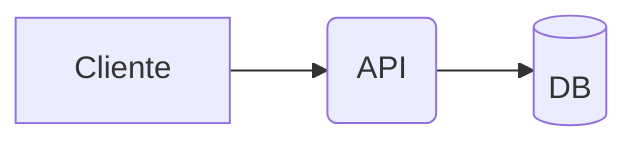

# 📖 Docs - FinBoost+

<div align="center">
  
  
  
  
  
</div>

Documentação técnica do FinBoost+ construída com MkDocs (Material). Centraliza guias de arquitetura, API, frontend, backend e práticas de desenvolvimento.

---

## 📚 Sumário

<details>
<summary><strong>Clique para expandir</strong></summary>

- [📖 Docs - FinBoost+](#-docs---finboost)
  - [📚 Sumário](#-sumário)
  - [🚀 Visão Geral](#-visão-geral)
  - [📁 Estrutura \& Navegação](#-estrutura--navegação)
  - [⚡ Como rodar localmente](#-como-rodar-localmente)
  - [📝 Convenções de escrita](#-convenções-de-escrita)
  - [🔧 Build \& Deploy](#-build--deploy)
  - [🤝 Contribuindo](#-contribuindo)
  - [📞 Suporte](#-suporte)
</details>

---

## 🚀 Visão Geral
Este diretório contém as fontes da documentação publicada em GitHub Pages. O conteúdo é gerado a partir de `docs/` usando o tema Material e recursos como Mermaid, abas, destaques de código e admonitions.

Links úteis:
- Site publicado: https://finboostplus.github.io/finboostplus-app/
- Configuração: `mkdocs.yml`
- Saída estática gerada: `site/` (não edite manualmente)

---

## 📁 Estrutura & Navegação

```
docs/
├── index.md                 # Home
├── project/                 # Visão geral, arquitetura, requisitos, diagramas, API contract
├── frontend/                # Docs do frontend (arquitetura, componentes, hooks, etc.)
├── backend/                 # Docs do backend (arquitetura, endpoints, auth, database)
├── development/             # Guia de desenvolvimento e logs de uso de IA
└── ...
```

- A sidebar/ordem é definida em `mkdocs.yml` na chave `nav`.
- Arquivos estáticos (imagens/diagramas) podem ser organizados em `docs/assets/` e referenciados via caminho relativo.

---

## ⚡ Como rodar localmente

Pré-requisitos: Python 3.10+ e `pip`.

```powershell
# Instalar dependências (local)
pip install mkdocs mkdocs-material mkdocs-mermaid2

# Servir com hot-reload
mkdocs serve
# Abra: http://127.0.0.1:8000
```

Opcional:
```powershell
# Verificar a navegação definida
type mkdocs.yml
```

---

## 📝 Convenções de escrita

- Títulos: use `##` e subseções com `###` (evite pular níveis)
- Nomes de arquivos: `kebab-case.md` (ex.: `getting-started.md`)
- Idioma: manter consistência em PT-BR
- Links internos: relativos (ex.: `[Arquitetura](../project/architecture.md)`)
- Imagens: colocar em `docs/assets/images/` e usar alt text descritivo
- Admonitions: dicas, avisos e notas

Exemplos úteis:

Admonitions
```md
!!! note "Observação"
    Este é um bloco de nota.
```

Mermaid
```md

```

Abas
```md
=== "cURL"
```bash
curl http://localhost:8080/actuator/health
```

=== "HTTPie"
```bash
http :8080/actuator/health
```
```

---

## ➕ Adicionando uma nova página

1) Crie o arquivo em `docs/` (por exemplo, `docs/frontend/state-management.md`)
2) Registre na navegação do `mkdocs.yml`:

```yaml
nav:
  - Frontend:
      - Estado Global: frontend/state-management.md
```

3) Rode `mkdocs serve` e valide links, títulos e formatação
4) Abra PR com a alteração e peça revisão

---

## 🔧 Build & Deploy

Geração local (artefatos em `site/`):

```powershell
mkdocs build
```

Publicação:
- O diretório `site/` é o output estático do MkDocs
- Para GitHub Pages: configure a publicação do branch que contém `site/` ou use uma action que rode `mkdocs build` e publique em `gh-pages`

---

## 🤝 Contribuindo

- Siga as convenções do repositório (`CONTRIBUTING.md`)
- Evite duplicação: conteúdos “fonte” (ex.: diagramas editáveis) podem ficar em `project_docs/`; 
- Mantenha a navegação organizada e consistente com o restante da documentação

---

## 📞 Suporte

- Issues: https://github.com/Finboostplus/finboostplus-app/issues
- Site: https://finboostplus.github.io/finboostplus-app/
- Email: finboostplus@gmail.com

---

<div align="center">
  <strong>📖 Documentação Técnica - FinBoost+</strong><br/>
  <em>Desenvolvido pelo Grupo 7 - +Prati & Codifica</em>
</div>
